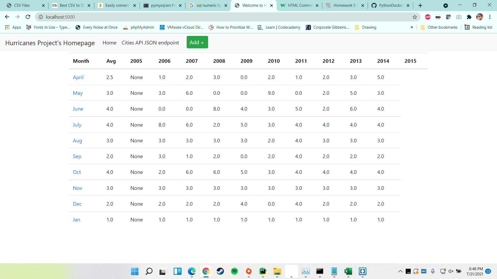
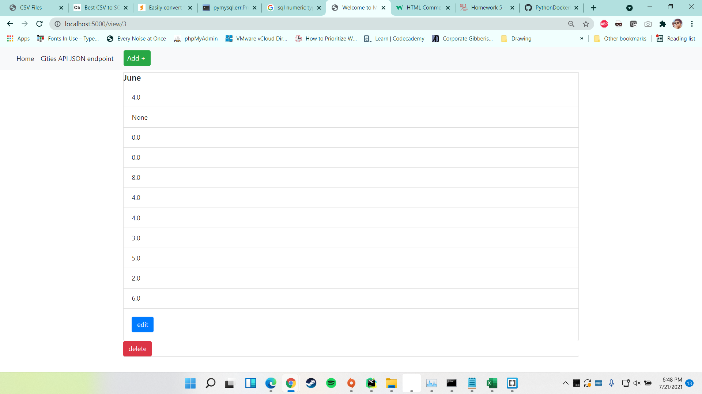
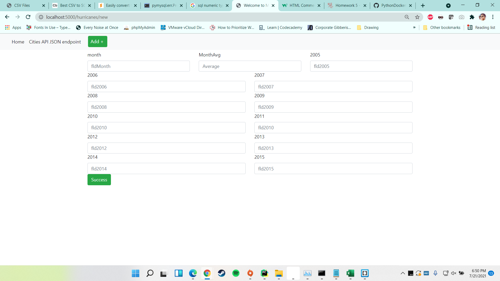
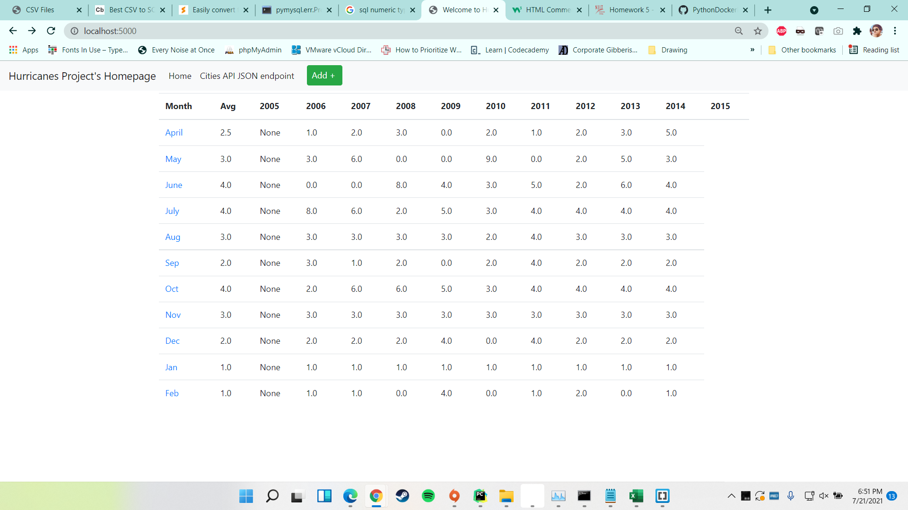

# Project Description
This project is a homework assignment to teach how to get Pycharm setup with Docker, Flask, MySQL, and Postman

I've attached TWO screenshots for adding an item, one on the "New" page/app and another showing an added entry to the index.
Screenshots:

