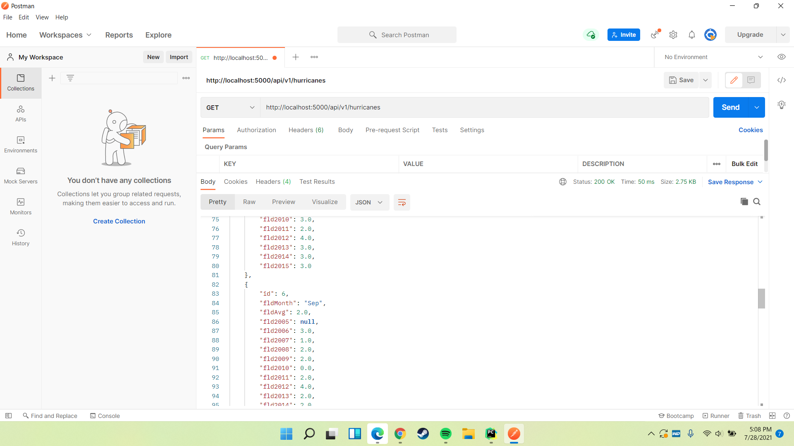
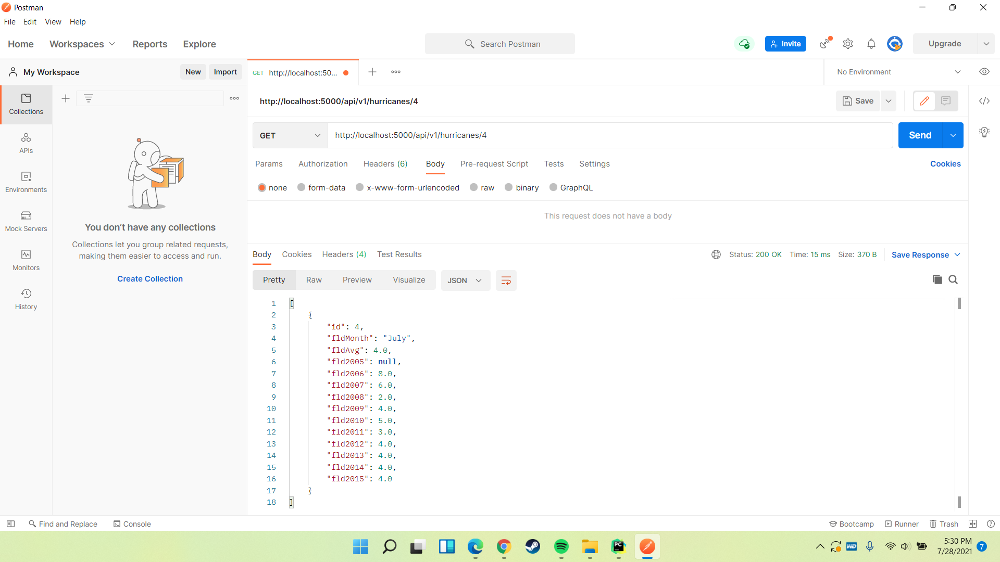
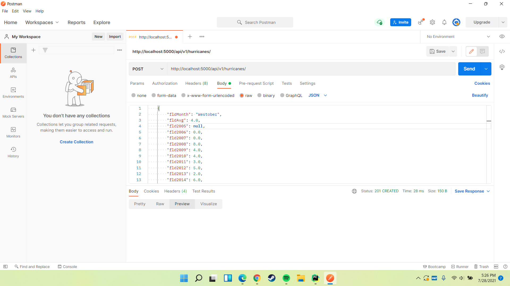
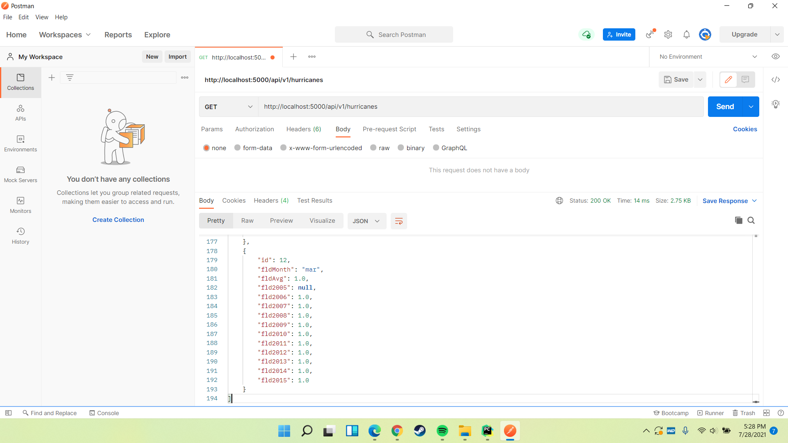
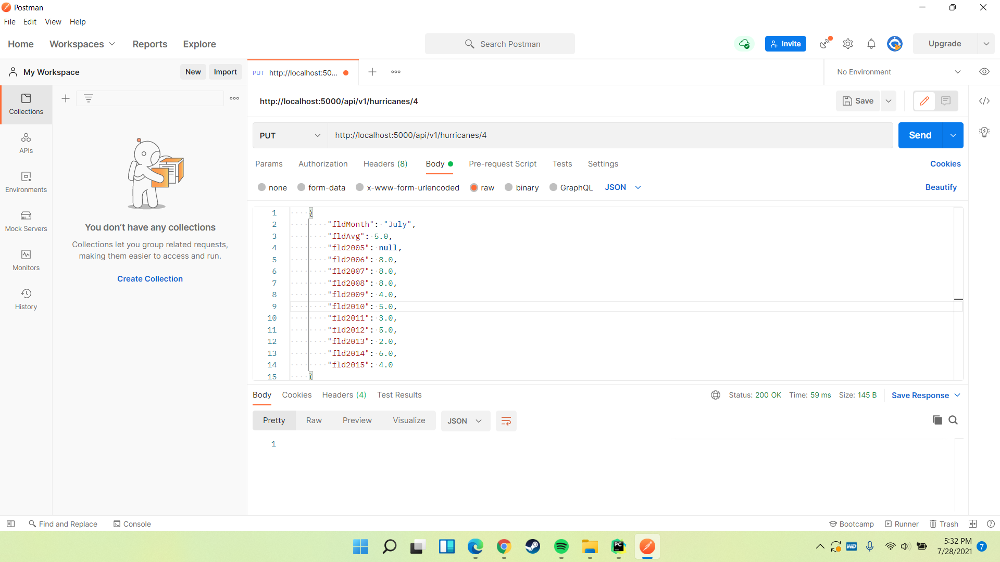
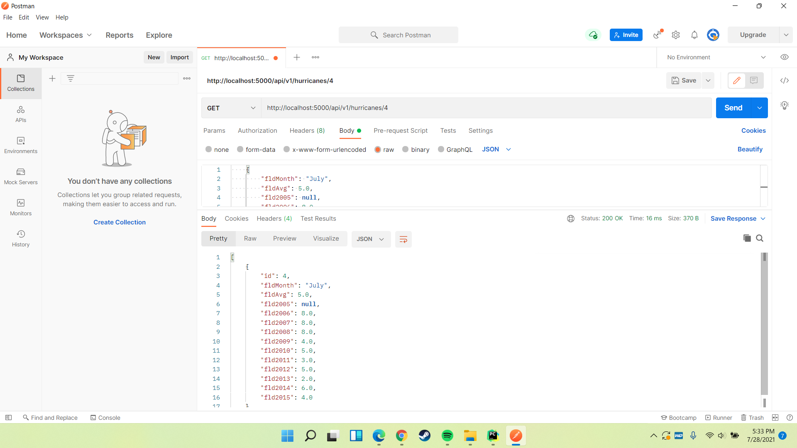
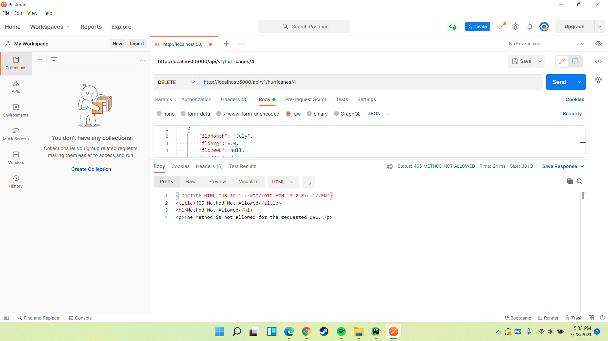

# Project Description
This project shows us how we can use POSTMAN to verify our REST API is working. I've attached the required screenshots with descriptions.

I'm currently having some trouble with the delete api, I may come back to fix it later.
Screenshots:

1.) List entire database with GET

2.) List Specific database entry with GET (Via item ID)

3a.) Add item through POST request (adding through postman UI/response code)

3b.) Get request of entire database verifying that previous POST/ADD request was satisfied correctly

4a.) Editing a database entry with PUT (response code)

4b.) Verifying PUT was successful in main DB

5.) DELETE request and response code

